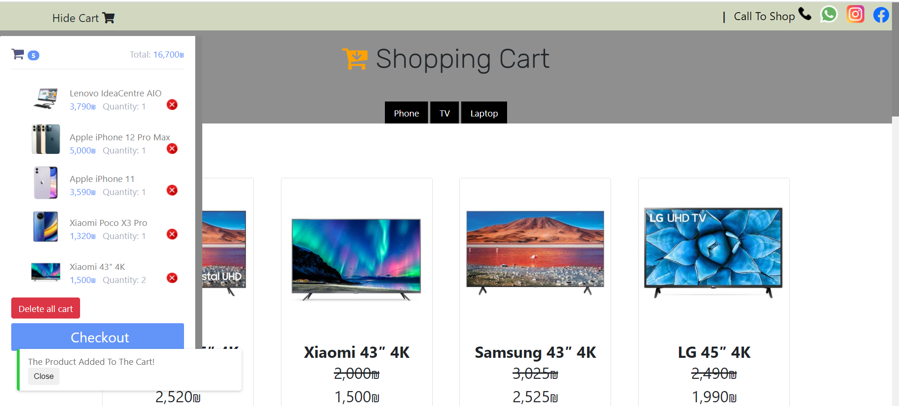

# Shopping Cart Project

## Author: Hadar Hubara

### The Project : Shopping Cart with HTML, CSS, JavaScript.

#

_Image from project._

#

## Project Details

I'm build Shopping Cart with HTML, CSS, and JavaScript.

For the design i used css, [Bootstrap,](https://getbootstrap.com/) and [W3css.](https://www.w3schools.com/w3css/w3css_references.asp)

Modal from - https://codepen.io/mteresa/pen/ygxbbJ

Alert from - https://alertifyjs.com

## Installation

`You don't have to install anything`

## Usage

1. Choose a products to shopping.

2. click on `Checkout` button, in the cart. (open modal)

3. fill the form, and Place Your Order!

#

## Notes

> The data is saved at LocalStorage, if you want to buy it later.

> If you bought the site before, The site will remember you and attach the order to your card.
